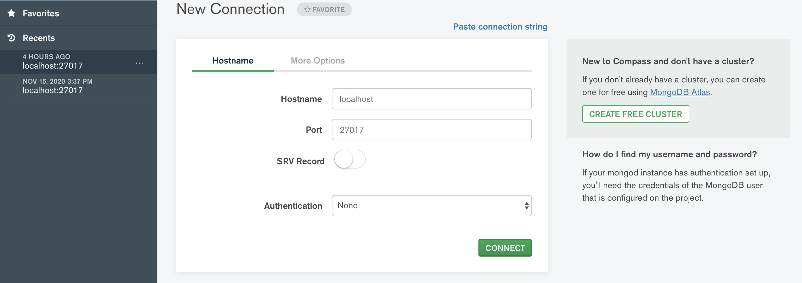

# Java Enterprise Web Application

## Introduction

Ceci est une application web pour l’inscription de cours de natation d'un nouveau centre aquatique utilisant Java EE avec le framework front-end struts 2. Pour la première itération, nous n'avons pas inclus de base de données mes plutons des fichiers .txt (le path vers ces fichiers devrait s'adapter d'une machine a une autre).Pour lancer cette application, il est nécessaire d'installer tomcat v9.

Nous avons décidé d'utiliser Struts 2 afin de profiter de ses multiples avantages dont sa facilité à être maintenue. Struts 2 offre notamment une conception simplifiée, car le code n'est pas étroitement lié au framework Struts ou à l'API Servlet. Il peut ce Plug-in facilement, les développeurs peuvent facilement utiliser d'autres technologies comme SiteMesh, Spring, Tiles, etc. De plus, les Actions sont également de simple plain old Java objects et elles n'ont pas besoin d'implémenter une interface ou d'étendre une classe. 

- Url du login pour les Utilisateurs : http://localhost:8080/INF5190_ProjetSession/Login.jsp Il est possible de s'authentifier en utilisant le **nom d'utilisateur : User1 et le password : pass1**

- Url du login pour les Administrateurs : http://localhost:8080/INF5190_ProjetSession/AdminLogin.jsp Il est possible de s'authentifier en utilisant le **nom d'administrateur : admintest1 et le password : pass1**

## Instruction pour l'utilisation de MangoDB (Mac OS / Linux)

Installer MangoDB sur votre machine à l'aide de la `commande brew install mongodb-community` dans votre terminal. Verifier que MangoDB est bien installer a laide de `mongo --version` et demarrer le a l'aide de :

>`brew services run mongodb-community`

Acceder au Shell mango a laide de la commande `Mango` afin de creer une nouvelle base de donnees sous le nom de `MyDatabase`.

Entrez 

>`use MyDatabase`, Vous pouvez également creer `MyDatabase` via l'interface graphique MongoDB Compass.

Une fois complétez, Telechargez et installer MongoDB Compass afin de se connecter en local vers la base de donnes qu'on vient de créer. Pour vous connecter à votre MongoDB local, vous définissez `Hostname` sur localhost et `Port` sur 27017. Ces valeurs sont par défaut pour toutes les connexions MongoDB locales (sauf si vous les avez modifiées). Appuyez sur Connect, et vous devriez voir les bases de données dans votre MongoDB local. 

Ici, vous devriez pouvoir voir `MyDatabase`.

Une fois la base de donnee MyDatabase creer, **il ne reste plus qu'a se "log in" dans l'application et les collections/documents necessaires de la db se gerereront automatiquement pour vous.** Toutes les dependances Jars necessaire au fonctionnement de MangoDB sont deja incluses dans le projet, répertoire `lib`.

### Pour plus d'information

https://zellwk.com/blog/install-mongodb/

https://zellwk.com/blog/local-mongodb/#:~:text=To%20connect%20to%20your%20local,databases%20in%20your%20local%20MongoDB.

## À ne pas oublier
Ne pas oublier d'inclure toutes les librairies dans le build path d’éclipse. Tous les fichiers jars nécessaires sont dans le répertoire `lib` de WEB-INF.

